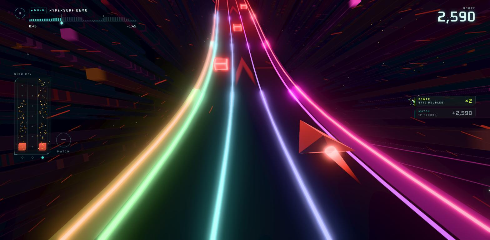
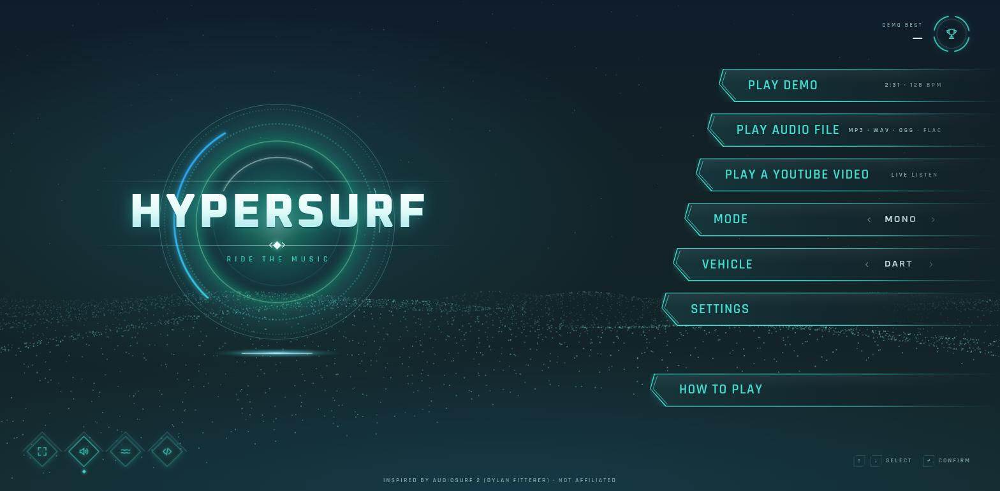

# hypersurf

A music ride in the browser. Pick a song, and hypersurf builds a track from it: calm parts climb, intense parts plunge and speed up, and coloured blocks land on the beat. Steer across three lanes, catch the blocks into a 3×7 grid and cash in matches. It runs as a static site with WebGPU, and falls back to WebGL2 where WebGPU is not available.

**Play it:** https://hec-ovi.github.io/hypersurf/





## How to play

- **Steer:** mouse, <kbd>←</kbd> <kbd>→</kbd> or <kbd>A</kbd> <kbd>D</kbd>, a gamepad (stick or d-pad), or drag on a touch screen.
- **Pause:** <kbd>Esc</kbd>, or Start on a gamepad.
- **Restart:** <kbd>R</kbd>.
- **YouTube mini player:** <kbd>V</kbd> hides or shows it.

Catch three or more touching blocks of one colour to make a match. Grey blocks take a block away. Power blocks multiply a match. **How to play** in the menu has the full rules.

## Sources

- **Demo:** a 2½-minute song synthesised in your browser.
- **Audio file:** MP3, WAV, OGG, FLAC or M4A. The whole song is analysed on your device and never uploaded.
- **YouTube:** paste a link and press Start, then share this tab with its audio in the prompt. This works in Chrome, Edge or Brave on a desktop computer. The game analyses the tab's sound live to find the beat; the audio is never recorded or stored. A **Nyan Cat** chip fills in the official upload.

## Special levels

**Special levels** in the menu holds hand-tuned rides, each with its own profile on top of the normal analysis (`src/audio/levels.js`). They use the rules of the mode you picked.

- **Hypersurf demo:** the synthesised demo song, exactly as it plays from the menu.
- **Nyan Cat:** super fast, with a top speed of about 1.7× Mono. The speed rushes and slows with the runs of chiptune notes: dense passages plunge downhill, sparse ones climb. A loop, corkscrew, double corkscrew, twist or flip comes every few seconds on the song's bar lines. The track is a rainbow and you ride the Nyan vehicle. The ride starts where the music kicks in, after the short intro.

The Nyan Cat song is **not included**. The level needs your own copy of the song (MP3, WAV, OGG, FLAC or M4A). Pick or drop it once: it is analysed on your device and kept only in this browser (IndexedDB), so later plays are one click. Nothing is uploaded. **Song file** on the levels screen replaces or forgets the stored copy. Without a copy, **Use the YouTube version instead** plays the official upload through the live listen mode (see YouTube above). That mode does not use the level's profile.

## Modes and vehicles

- **Casual:** slower and sparser, with a longer match timer and safe shoulders.
- **Mono:** the classic rules.
- **Ninja:** faster and denser. A spike wipes the whole grid.

The vehicle only changes how you look; handling and hitbox are the same for all three.

- **Dart:** the original ship.
- **Wave:** a neon hover-surfboard.
- **Nyan:** a voxel cat with a rainbow trail.

## Run locally

Node runs only in Docker, so nothing is installed on the host:

```sh
scripts/dev.sh test         # run the test suite
scripts/dev.sh serve 8080   # serve the site at http://127.0.0.1:8080/
```

## Docs

- [docs/research.md](docs/research.md): the research and design brief (analysis, track, rules, rendering).
- [docs/art-direction.md](docs/art-direction.md): the UI art direction.

## Credits

- Inspired by Audiosurf 2 (Dylan Fitterer); not affiliated.
- Nyan Cat by Chris Torres; fan tribute, not affiliated.
- You are responsible for the content you play.

## License

MIT. See [LICENSE](LICENSE).
