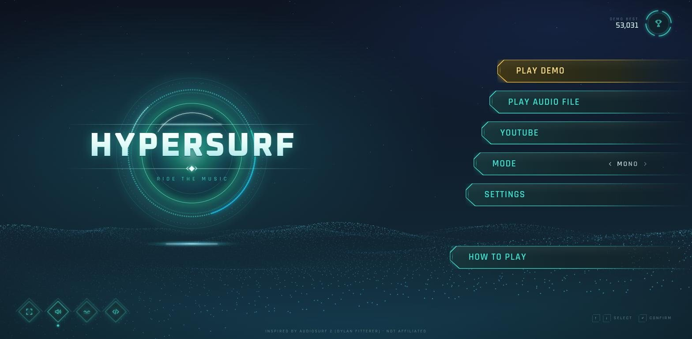
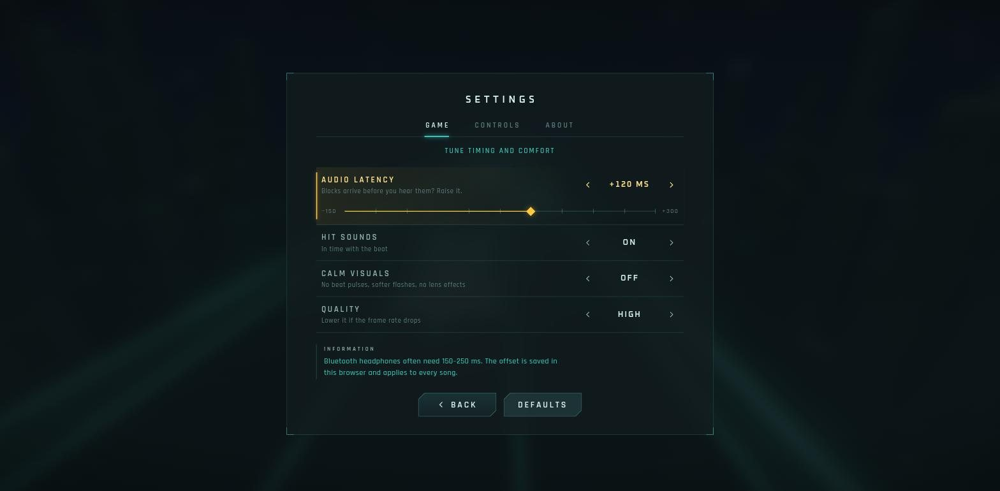
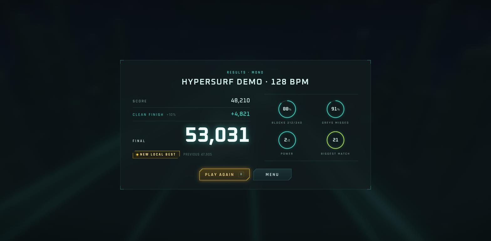
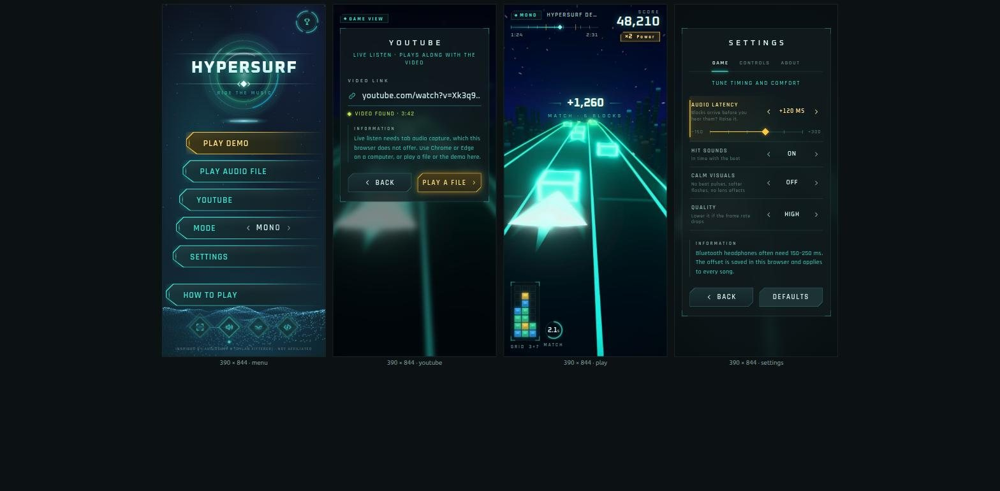
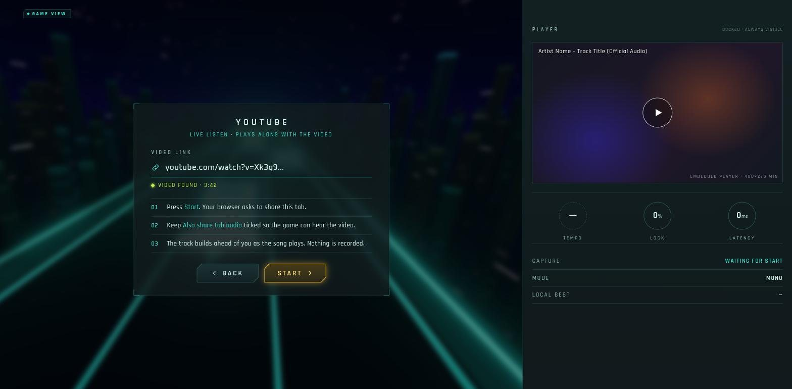

# hypersurf UI art direction

This document is binding for every UI control in hypersurf: the menu, buttons, source and mode pickers, settings, loading, the in-play HUD, pause, results, toasts and the YouTube layout. The gameplay, track, effects and world stay exactly as they are. Only the DOM layer on top of the canvas changes.

Base: the **"faithful"** mockup, which won the judged round (99 points against 95.5 for "alive" and 92.5 for "hud-first", with fidelity counted double). It is combined with grafts both judges asked for. The biggest graft is that the in-play HUD now follows the "hud-first" layout: nothing sits over the track, the progress bar shows the song's intensity, and match events go to an event feed on the right edge. Where this text and the mockup disagree, this text wins. The mockup is in `mockup/index.html` (hash routes `#menu #youtube #file #mode #settings #loading #play #pause #results #toast`, `?shot` hides its nav) and is a visual reference only.



In one line: **a calm, precise, premium in-game sci-fi interface.** It uses dark desaturated teal-charcoal surfaces, cyan hairlines instead of boxes, small tracked uppercase labels, big numerals only for key stats, chamfered buttons with angled ends and diamond icons, and one warm gold element per screen that marks focus. It is not a website: no cards with drop shadows, no rounded corners, no loud gradients, no grey bars.

---

## 1. Rules that hold everywhere

1. **Gold means focus, and only focus.** Every screen has exactly one gold control, the one that has focus. Arrow keys, Tab, gamepad and mouse hover all move it (hover moves focus, as in a game menu). Nothing else is gold: not the multiplier, not "new best", not warnings, not tips.
2. **Cyan is the interface.** Outlines, hairlines, active tabs, gauges, fills and positive values are all cyan.
3. **Other colours are sparse and each has one meaning.**
   - Lime means positive status: power multiplier, new best, video found, listening, bonus lines.
   - Orange-red `#ff5a2a` means overfill.
   - Orange `#ff8a3d` means a warning.
   - Red `#ff5a4a` means an error.
   - Block colours in the HUD grid come from the game's intensity palette. They are gameplay data, not UI colour.
4. **Lines, not boxes.**
   - Separate things with 1px hairlines, corner brackets and thin 1–1.5px outlines.
   - Only three things get a filled surface: panels, buttons and toasts.
   - No `border-radius` anywhere except rings and gauges, which are true circles.
5. **Uppercase with letter-spacing for labels, sentence case for prose.** Any sentence a player reads is sentence case in Rajdhani 500.
6. **Nothing covers the track during play** (see §9.1), and **nothing ever covers the YouTube player** (§8.3).
7. **Calm by default.** Menu motion is slow ambient drift. The game never pulses to the beat, never wipes the screen with light, and has no gradient sweeps. The in-play HUD animates only in response to game events.

---

## 2. Fonts

```html
<link rel="preconnect" href="https://fonts.googleapis.com">
<link rel="preconnect" href="https://fonts.gstatic.com" crossorigin>
<link rel="stylesheet" href="https://fonts.googleapis.com/css2?family=Oxanium:wght@500;600;700;800&family=Rajdhani:wght@500;600;700&display=swap">
```

| Role | Family | Weights | Used for |
|---|---|---|---|
| Display and numerals | **Oxanium** | 800 wordmark and big titles (PAUSED), 700 final score and mode names, 600 HUD score, screen titles, values and all other numbers, 500 small numbers | Square geometric sci-fi letterforms. Always `font-variant-numeric: tabular-nums` on numbers that change. |
| UI | **Rajdhani** | 600 labels and buttons, 700 chips and badges, 500 prose | Narrow technical letterforms that suit tracked caps. |

Fallback stacks are `'Oxanium', 'Rajdhani', system-ui, sans-serif` and `'Rajdhani', 'Oxanium', system-ui, sans-serif`. Font loading must never block the game: use `display=swap`. The HUD reserves widths with tabular numerals so a font swap does not shift the layout.

### Type scale

The minimum rendered size is **11px** anywhere. The mockup's 10px credit line on the phone is not allowed.

| Token | Font | Size 1920 / 390 | Tracking | Use |
|---|---|---|---|---|
| `wordmark` | Oxanium 800 | `clamp(40px, 6.1vw, 92px)`: 92 / 41 | .05em | HYPERSURF on the menu, with a text gradient `#fff → #e2fbf8 → #9fe3ea` and a glow `drop-shadow(0 0 14px rgba(63,224,208,.45))` |
| `title-xl` | Oxanium 800 | `clamp(48px, 7vw, 104px)`: 104 / 52 | .08em | PAUSED |
| `num-xl` | Oxanium 700 | `clamp(48px, 6vw, 80px)`: 80 / 48 | .02em | Final score, with glow `0 0 22px rgba(63,224,208,.55)` |
| `num-l` | Oxanium 600 | `clamp(32px, 3.8vw, 56px)`: 56 / 32 | .02em | HUD score, with glow `0 0 16px rgba(63,224,208,.5), 0 2px 4px rgba(0,0,0,.7)` |
| `num-m` | Oxanium 600 | 26 / 20 | .04em | Pause stats, feed values, big percent labels |
| `screen-title` | Oxanium 600 | 18 / 16 | .38em (add a matching `padding-left` so it centres optically) | SETTINGS, SELECT MODE, RESULTS |
| `btn-l` | Rajdhani 600 | 26 / 21 | .07em | Chamfered menu buttons |
| `btn-s` | Rajdhani 600 | 17 / 15 | .2em | Panel actions (BACK, START, PLAY AGAIN) |
| `row` | Rajdhani 600 | 16 / 14 | .2em | Settings row names, stage names |
| `body` | Rajdhani 500 | 16 / 15, line-height 1.45 | .02em | Descriptions, steps, toast text |
| `eyebrow` | Rajdhani 600 | 13 / 12 | .32em | Section labels, cyan subtitles |
| `micro` | Rajdhani 600 or 700 | 12 / 11 | .26–.3em | HUD captions (SCORE, MATCH), chips, key hints |

---

## 3. Colour tokens

These go on `:root` in `styles.css`. The game is always dark: the `prefers-color-scheme` guards restate the same values, and `color-scheme: dark` is set.

```css
:root {
  /* surfaces: dark desaturated teal-charcoal */
  --bg-0: #050d10;            /* page, letterbox */
  --bg-1: #0b1719;            /* base surface, theme-color */
  --bg-2: #12272a;            /* raised surface */
  --bg-3: #173236;            /* hover wash */
  --navy: #071626;            /* upper-sky tint on the menu only */
  --panel: rgba(9, 22, 25, .78);
  --panel-solid: #0c1c1f;
  --pad-hud: rgba(5, 13, 16, .58);   /* HUD housings over the live game */

  /* accent */
  --cyan: #3fe0d0;
  --cyan-hi: #8ff7ee;
  --cyan-mid: rgba(63, 224, 208, .55);
  --cyan-dim: rgba(63, 224, 208, .28);
  --line: rgba(120, 225, 218, .16);    /* hairline */
  --line-2: rgba(120, 225, 218, .30);  /* strong hairline, idle outline */
  --glow: rgba(63, 224, 208, .45);

  /* ink */
  --text: #d8f4f1;
  --text-2: #9dc0bd;
  --text-3: #7fa3a0;          /* raised from the mockup's #5d7f7e (4.0:1) */

  /* focus, and nothing else */
  --gold: #ffc940;
  --gold-hi: #ffe08a;
  --gold-glow: rgba(255, 196, 64, .5);

  /* sparse meanings */
  --lime: #c6f04a;            /* positive: power ×2, new best, found, listening, bonus */
  --warn: #ff8a3d;            /* warning toast */
  --red: #ff5a4a;             /* error toast, spike wipe */
  --overfill: #ff5a2a;        /* full column (PALETTE.overfill, research §4) */

  /* game intensity stops, for grid tiles (read from palette.js; do not restyle) */
  --i0: #3a2cff; --i1: #0fa3ff; --i2: #19e0a0; --i3: #ffd23a; --i4: #ff7a1a; --i5: #ff1f4b;

  --gutter: clamp(16px, 3.2vw, 56px);
  --ease-out: cubic-bezier(.2, .7, .2, 1);
  --ease-in: cubic-bezier(.4, 0, 1, 1);
  --ease-back: cubic-bezier(.34, 1.56, .64, 1);
  color-scheme: dark;
}
```

Gradients:

| Where | Value |
|---|---|
| Menu sky, also used for loading and mode select | `radial-gradient(55% 55% at 26% 40%, rgba(18,92,104,.45), transparent 70%)`, `radial-gradient(90% 40% at 50% 100%, rgba(14,70,96,.5), transparent 75%)`, `linear-gradient(180deg, #071626 0%, #0a1c22 34%, #0b1f23 70%, #0c2629 100%)`. The navy is only the top third, as a nod to reference 1. The body of the screen is teal-charcoal. |
| Chamfered button fill | `#0f3239 → #0b242b → #0a1d22` (left to right), plus a top sheen `linear-gradient(180deg, rgba(255,255,255,.05), transparent 45%)` |
| Gold focus fill | `#3c3310 → #252612 → #10201d` |
| Panel over a blurred game | the frozen canvas with `filter: blur(14px) brightness(.42) saturate(.7); transform: scale(1.06)`, then a tint `linear-gradient(180deg, rgba(6,18,21,.55), rgba(6,18,21,.72))`, then a vignette `radial-gradient(120% 90% at 50% 45%, transparent 55%, rgba(0,0,0,.55))` |

### Measured contrast (WCAG ratio on `--panel-solid` #0c1c1f)

| Token | Ratio |
|---|---|
| `--text` | 15.1 |
| `--text-2` | 8.9 |
| `--text-3` | 6.4 |
| `--cyan` | 10.6 |
| `--gold` | 11.4 |
| `--gold-hi` | 13.6 |
| `--lime` | 13.3 |
| `--warn` | 7.5 |
| `--red` | 5.7 |
| `--overfill` | 5.6 |

On the gold focus fill `#3c3310`, `--gold-hi` is 9.7 and `--text-3` is 4.6. Every text and background pair must stay at 4.5 or above. Text never goes on a surface lighter than `--bg-3`.

Gold (relative luminance .63) and cyan (.59) have nearly the same brightness. That is why focus also needs a cue that is not colour (§11).

---

## 4. Spacing, sizes, shapes

- **Spacing** uses a 4px base: 4, 8, 12, 16, 22, 28, 40, 56. Screen edges use `--gutter` (16px on a phone, 56px at 1920).
- **Hairlines** are 1px. Outlines are 1.5px, and 2px for the focused control. Corner brackets are 14px (panels) or 10–12px (HUD), drawn with 1.5px strokes.
- **Touch targets** are at least 44×44px, and at least 48px tall on the phone.

### 4.1 Chamfered menu button (`.cb`)

Reference 1's shape is a **single pointed left end**: a short steep top edge down to a point just above the middle, then a longer edge back to the bottom. A thin inner line runs parallel to that end. It is not the symmetric "octagon" end in the mockup, which must be corrected.

```css
.cb {
  --h: 64px;                  /* 54px on phone, 46px for compact rows */
  --a: 8px;                   /* top cut */
  --b: 30px;                  /* bottom cut (26px at --h 54) */
  --p: 46%;                   /* point height */
  --o1: var(--cyan); --o2: rgba(63,224,208,.25);
  --f1: #0f3239; --f2: #0b242b; --f3: #0a1d22;
  --tc: var(--cyan);
  --shape: polygon(var(--a) 0, 100% 0, 100% 100%, var(--b) 100%, 0 var(--p));
  position: relative; display: flex; align-items: center; gap: 16px;
  height: var(--h); padding: 0 28px 0 calc(var(--b) + 26px);
  font: 600 26px/1 var(--f-ui); letter-spacing: .07em; text-transform: uppercase; color: var(--tc);
  filter: drop-shadow(0 0 7px rgba(63,224,208,.28));
  mask-image: linear-gradient(90deg, #000 0 62%, rgba(0,0,0,.25) 92%, transparent);
  transition: transform 160ms var(--ease-out), filter 160ms, color 160ms;
}
.cb::before, .cb::after { content: ""; position: absolute; clip-path: var(--shape); z-index: -1; }
.cb::before { inset: 0;     background: linear-gradient(90deg, var(--o1) 0 40%, var(--o2)); }   /* outline */
.cb::after  { inset: 1.5px; background: linear-gradient(180deg, rgba(255,255,255,.05), transparent 45%),
                                        linear-gradient(90deg, var(--f1), var(--f2) 45%, var(--f3)); } /* fill */
```

- **Inner bevel line.** An inline SVG `<svg class="bevel" viewBox="0 0 40 64" width="40" height="100%">` sits at the left. It holds `<polyline points="14,5 6,29.4 33,59">`, drawn with a 1.25px stroke in `var(--o1)` at 70% opacity, fading out along both arms with a linear gradient. This is the double outline in reference 1.
- **Meta text.** Optional right-aligned text sits inside the button in `micro` size, `--text-2`, with `margin-left: auto; margin-right: 18%` so it stays clear of the fade. Examples: `2:31 · 128 BPM`, `MP3 · WAV · FLAC`, `YOUTUBE · LIVE LISTEN`. An inline selector (`‹ MONO ›`) goes in the same slot.
- **Hover**, when the button does not have focus: the glow grows to `drop-shadow(0 0 10px rgba(63,224,208,.45))`. Hover also moves focus, so on a mouse this state lasts only for a moment.
- **Focus** (see §11):
  - Colours switch to `--o1: var(--gold); --o2: rgba(255,201,64,.25)`, the gold fill gradient, and `--tc: var(--gold-hi)`.
  - Glow becomes `drop-shadow(0 0 10px var(--gold-glow))`.
  - The button moves `transform: translateX(-10px)`.
  - A **7px filled gold diamond** (◆) appears 12px left of the label.
  - The outline layer grows to `inset: 0` with a 2px fill inset.
- **In a stack**, buttons are right-aligned and **bleed off the right edge of the screen** (no right gutter). Each lower button is wider: `width: calc(min(40vw, 540px) + var(--i) * 22px)`, with `--i` = 0, 1, 2, … from the top. Gap 22px. A separate last button sits below an extra `clamp(24px, 7vh, 80px)` gap, the "quit slot".

### 4.2 Panel action (`.act`)

Thin outline buttons as in reference 2 (BACK / NEXT with chevrons).

- **Size:** height 46px (48px on phone), min-width 150px, padding 0 22px, `btn-s` type, 14px chevron SVGs.
- **Shape:** `polygon(12px 0, 100% 0, 100% calc(100% - 12px), calc(100% - 12px) 100%, 0 100%, 0 12px)`, with top-left and bottom-right cut.
- **Layers:** a 1px outline layer in `--line-2` (`--cyan-mid` on hover) and a fill layer `linear-gradient(180deg, rgba(18,44,48,.95), rgba(10,26,29,.95))`.
- **Focus:** gold outline, text `--gold-hi`, gold fill `rgba(58,48,16,.95) → rgba(26,28,16,.95)`, 8px gold glow, and the ◆ marker before the label.
- **Key cap:** `.kbd` is 22px, 1px `--line-2` outline, 4px chamfer and Oxanium 11px. It appears inside an action when it has a shortcut (`PLAY AGAIN [R]`).

### 4.3 Diamond icon button (`.dia`)

- **Box:** 58×58px (52px on phone) with a transparent background.
- **Diamond (`::before`):**
  - `inset: 8px; transform: rotate(45deg)`, 1.5px border in `--cyan-mid`.
  - Fill `radial-gradient(circle, rgba(63,224,208,.16), rgba(10,34,40,.85) 70%)`.
  - Shadow `box-shadow: 0 0 12px rgba(63,224,208,.28), inset 0 0 10px rgba(63,224,208,.18)`.
- **Outer tick (`::after`):** `inset: 2px`, rotated, with only its top and left borders drawn (1px, `--line-2`). This is the double frame from reference 1.
- **Icon:** a 22px inline SVG, 1.5px stroke, square caps, mitre joins, `currentColor` (`--cyan`).
- **On state** (for toggles): the border turns full `--cyan`, and a 5px cyan diamond pip sits 12px below the button.
- **Focus:** gold border, gold radial fill, `--gold-hi` icon.

Four sit in a row bottom-left, 22px apart: **fullscreen**, **hit sounds** (toggle), **calm visuals** (toggle) and **source code** (a neutral `</>` glyph, not a brand logo). Each has an `aria-label` and a `title`.

### 4.4 Ring button and ring gauge

**Ring button** (top-right of the menu):

- 74px (54px on phone). The SVG has an outer ring at r=34 split into 4 segments (2px stroke, `stroke-dasharray` for about 70° arcs with 20° gaps), rotating once every 26s. It also has an inner ring at r=28 (1px `--line-2`) and a 26px trophy glyph.
- To its left sit `DEMO BEST` (`micro`, `--text-2`) and the score (Oxanium 600, 20px, `--text`).
- It opens the **Local bests** panel (§8.5).

**Ring gauge** (reference 3, used for stats):

- SVG `viewBox 0 0 76 76`, rotated -90°.
- Track circle r=34 with a 1.5px `--line-2` stroke. Value arc on the same circle with a 2.5px `--cyan` stroke, butt caps, and `filter: drop-shadow(0 0 4px var(--glow))`.
- Optional dotted tick ring at r=37: 1px stroke, `stroke-dasharray: 1 5`, `--line`.
- Centre value in Oxanium 600 19px with its unit in 11px `--text-2`. Label below in `micro`.

Sizes: 76px (results, dock), 64px (HUD match ring), 58px (phone results), 46px (phone HUD).

### 4.5 Panel

- **Surface:** `background: var(--panel); border: 1px solid var(--line)`, with four **corner brackets** (14px, 1.5px `--cyan-mid`, offset -1px).
- **Blur:** `backdrop-filter: blur(6px)` is **allowed only while the game is not rendering** (menu, paused, results). It is never used over a live frame.
- **Padding:** `clamp(22px, 3.4vw, 40px) clamp(18px, 4vw, 56px)`.
- **Header**, centred:
  - `screen-title` in `--text`.
  - Optional underline tabs.
  - A cyan `eyebrow` subtitle, 8px below.

### 4.6 Controls from reference 2 and 3

- **Underline tabs:**
  - `row` type at 14px with .26em tracking, in `--text-3`. The active tab is `--text` with a 2px `--cyan` underline (8px glow) sitting on the 1px `--line` rule under the tab strip.
  - Tabs are 44px apart. Q/E or LB/RB switch between them.
- **Arrow selector `‹ VALUE ›`:**
  - A three-column grid of 28px, 132px and 28px (26 / 88 / 26 on phone).
  - Chevrons are 14px, `--text-2`. The value is Oxanium 600 15px, .16em tracking, uppercase, `--text`.
  - When the row has focus, both chevrons and the value turn `--gold-hi`.
  - ←/→ step through values without wrapping. The chevron at the end of the range drops to 30% opacity.
- **Settings row:**
  - Grid `1fr auto`, padding 14px 10px, 1px `--line` rule underneath. The name is `row` type in `--text-2`, with a one-line `body` 13px description in `--text-3` under it.
  - Focus: a 2px gold bar on the left edge (8px glow), a wash `linear-gradient(90deg, rgba(255,201,64,.08), transparent 70%)`, the name in `--gold-hi`, and the ◆ marker.
- **Hairline slider:**
  - The rail is 1px `--line-2`. The fill is 1.5px `--cyan` (gold when focused).
  - Ticks every 10% are 9px tall in `--line-2`. A **0 mark** is 13px tall in `--text-2`. End labels are `micro`.
  - The thumb is a **12px diamond**: `--bg-1` fill with a 1.5px `--cyan` border, filled solid gold when focused.
- **INFORMATION block:** a 1px `--cyan-dim` left rule with 14px padding. `INFORMATION` in 11px `micro` `--text-2`, then `body` 15px in `--cyan` at 90% opacity, max width 60ch. It always explains **the row that has focus**.
- **Chips:**
  - 22px high, 6px top-left chamfer, 1px outline, `micro` 700 type, with a 5px diamond before the label.
  - Colours: cyan for mode, lime for FOUND or LISTENING, orange for warnings.
- **Hairline list rows** (reference 3): label left in `row` type, value right, 1px `--line` rule under each. A 14px right chevron appears when the row navigates.

---

## 5. Motion

| What | Timing |
|---|---|
| Focus change (colour, glow, translateX, ◆) | 160ms `--ease-out` |
| Screen in | 280ms: opacity 0→1, plus translateY(8px)→0 for panels or translateX(24px)→0 for stack buttons |
| Screen out | 160ms opacity, `--ease-in` |
| Stagger (stack buttons, mode cards, results rows) | 45ms per item |
| Tab switch | row content cross-fades 180ms and the underline slides 220ms `--ease-out` |
| Selector value change | the old value slides 6px out while the new one fades in, 140ms |
| Toast | in 220ms (translateY(-12px)→0, opacity), out 180ms. Lifetime hairline shrinks linearly. |
| Menu emblem rings | rotate one turn per 60s and 90s (reverse) |
| Ring button segments | one turn per 26s |
| Menu particle terrain | wave phase 0.15 rad/s, twinkle 0.2–0.6 Hz per star, drawn at 30 fps max |
| Loading "now" stage diamond | opacity 1→.35→1 every 1s |
| Results count-up | raw 600ms, each bonus row 300ms (150ms apart), final 700ms, easeOutCubic; then the badge fades in with scale .96→1 over 200ms |

In-play HUD animations are in §9.3.

- Animate **only `transform` and `opacity`** during play. Never animate `box-shadow`, `filter`, width, height or `clip-path` there.
- There is no screen-wide light wipe, no beat pulse on menus, no brightness flash on screen changes, and no parallax on the pointer.

---

## 6. Menu backdrop and emblem

### 6.1 Backdrop

The menu sky gradient (§3) sits under a **2D canvas** particle terrain. Do not create a second WebGL context: the game renderer owns the GPU.

- **Terrain:**
  - About 6,000 jittered points on a grid 90 columns by 64 rows deep, projected in perspective. The horizon is at 58% of the height, and the terrain fills the bottom 45%.
  - Height comes from two sine octaves plus low-frequency noise, and scrolls slowly.
  - Points are 1–1.6px in `rgba(120,225,218,α)`, with α from .12 (far) to .55 (near). Points on a ridge crest are slightly brighter (`--cyan-hi` at .6).
- **Stars:** 160 stars in the upper 55%, 1px, α .15–.5, twinkling.
- **Performance:**
  - Cap devicePixelRatio at 1.5.
  - Stop the loop when the menu is hidden, during play and when `document.hidden`.
  - Under calm visuals or `prefers-reduced-motion`, draw **one frame** and stop.

### 6.2 Emblem

Inline SVG, `min(38vw, 470px)` square. Its layers, from the back:

1. A dotted particle ring at r≈46%: a 1.5px stroke with `dasharray 1 4` in `--cyan` at .5.
2. A thin outer ring at r≈48% in `--line-2`.
3. A cyan-to-blue arc covering about 110° at r≈42%, stroke 3px, from `--cyan` to `#1f8fff`, with a glow.
4. A soft green energy ring: r≈33%, stroke 10px, `rgba(25,224,160,.35)`, blurred 6px. This is static, so the filter is fine.
5. A teal core: `radial-gradient(rgba(18,92,104,.6), transparent 70%)`.
6. A **horizontal light rule** through the wordmark: 1px, `transparent → rgba(143,247,238,.55) → #dcfffc → … → transparent`, extending 24% past the emblem on each side. It carries an 11px **diamond gem** at its centre, below the wordmark, flanked by 8px chevrons.
7. A **light flare** 6% below the emblem: a 22px-tall radial ellipse `rgba(220,255,250,.95) → rgba(80,220,255,.55) → transparent`, with a 1px white core line.

The wordmark `HYPERSURF` (`wordmark` token) is centred on the rule. Under it is the tagline `RIDE THE MUSIC` in `eyebrow` style at .5em tracking, `--cyan` at .85.

Layers 1 and 3 rotate (§5). Nothing pulses.

---

## 7. Screens at 1920×1080

The canvas stays full-bleed behind every screen, except in the YouTube layout (§8.3).

### 7.1 Main menu

- **Grid:** two columns, `minmax(0, 1.05fr) minmax(0, .95fr)`, which is about 1008px and 912px.
- **Left column:** the emblem is centred with padding `48px 0 140px var(--gutter)`, which puts its centre at about 46% of the height.
- **Right column:** the chamfered stack is vertically centred with padding `120px 0 150px`.

The stack, from the top, with the meta text for each button:

| Button | Meta / behaviour |
|---|---|
| **PLAY DEMO** | `2:31 · 128 BPM`. Default focus. |
| **PLAY AUDIO FILE** | `MP3 · WAV · OGG · FLAC` |
| **PLAY A YOUTUBE VIDEO** | `YOUTUBE · LIVE LISTEN`. Research §5 says not to put "YouTube" in a mode or game name, so it appears only as the source. |
| **MODE** | Inline `‹ MONO ›`: ←/→ cycle the mode here, and Enter or click opens Mode select. |
| **SETTINGS** | |
| **HOW TO PLAY** | In the separate quit slot, after the extra gap. |

Other elements:

- **Top-right**, at `top: clamp(16px, 3vh, 34px); right: var(--gutter)`: `DEMO BEST 53,031` and the ring button. Before any run, the score shows `—`.
- **Bottom-left**, at `left: var(--gutter); bottom: clamp(24px, 5vh, 52px)`: the diamond row.
- **Bottom-right:** key hints `↑↓ SELECT · ↵ CONFIRM · ESC BACK` in `micro` `--text-3` with `.kbd` caps. They switch to gamepad glyphs while a gamepad is connected.
- **Bottom centre**, 14px from the edge: `INSPIRED BY AUDIOSURF 2 (DYLAN FITTERER) · NOT AFFILIATED` in `micro` `--text-3`, as a link.
- **Messages** from the menu (for example "that file could not be decoded") use toasts (§8.4), not inline text.

### 7.2 Audio file

- **Layout:** a centred panel 760px wide over the menu backdrop. The title is `AUDIO FILE`, with the subtitle `STAYS ON YOUR DEVICE · NOTHING IS UPLOADED`.
- **Drop zone:** 42px padding and a 1px dashed `rgba(63,224,208,.28)` border.
  - Background: faint vertical scan lines, `repeating-linear-gradient(90deg, rgba(63,224,208,.03) 0 1px, transparent 1px 22px)` over `rgba(6,18,20,.5)`.
  - 22px corner reticles (2px `--cyan`).
  - An 84px icon: a waveform glyph inside a thin ring that turns once every 40s.
  - `DROP A SONG HERE` in Oxanium 600, 22px, .22em.
  - `OR` in `micro`.
  - The **BROWSE FILES** action, which has default focus.
  - A formats line in `eyebrow` cyan.
- **Drag-over:** the reticles move 6px outward (transform, 160ms), the border turns solid `--cyan-mid`, and the fill brightens to `rgba(63,224,208,.06)`.
- **Actions:** BACK at the bottom. Esc also goes back.

### 7.3 Mode select

- **Header:** `SELECT MODE`, subtitle `SAME TRACK · DIFFERENT RULES`.
- **Cards:** three cards in a row, each up to 340px wide with a 24px gap, centred at about 40% of the height.
- **Card construction:**
  - A chamfered polygon with a 22px cut on the top-left and bottom-right corners.
  - The outline layer is `linear-gradient(160deg, var(--o), rgba(63,224,208,.08) 70%)`, with a fill of `rgba(16,40,44,.96) → rgba(8,20,23,.96)`.
- **Card content:**
  - A 54px **diamond glyph** holding a 24px icon.
  - The mode name in Oxanium 700, 28px, .12em.
  - A two-line description in `body`.
  - A hairline table of **exact** stats taken from the code, so every number is true (`rules.js` `RULES` and `songmap.js` mode parameters):

| | Casual | Mono | Ninja |
|---|---|---|---|
| SPEED | ×0.8 | ×1.0 | ×1.26 |
| BLOCKS | up to 2.3/s | up to 5.2/s | up to 7.8/s |
| MATCH TIMER | 1.75 s | 1.5 s | 1.5 s |
| HAZARDS | greys erase one | greys erase one | spikes erase all |
| SHOULDERS | safe | — | — |
| BONUS (lime line) | Clean finish +10% | Clean finish +10% | Stealth +25% |
| BEST | local best for this song and mode, or `—` | | |

  Each numeric row also gets a small 5-pip meter (slanted 12×7px pips, skewX(-24deg)) next to the number, as a glanceable scale.

- **Selected versus focused:** these are different states.
  - The **selected** mode has a **cyan** `◆ SELECTED` chip top-right and a full `--cyan` outline.
  - The **focused** card is gold, with its pips in gold.
  - Enter or click selects. A card can be focused and not selected.
- **Actions:** BACK and SELECT with chevrons, centred under the cards. Esc goes back.

### 7.4 Settings



- **Layout:** a centred panel 760px wide over the blurred game when opened from pause, or over the menu backdrop when opened from the menu.
- **Header:** `SETTINGS`.
- **Tabs:**
  - **AUDIO:** subtitle `LINE THE BLOCKS UP WITH WHAT YOU HEAR`.
    - **AUDIO LATENCY:** a selector with a slider from −150 to +300 ms in 5 ms steps. It shows the value as `+120 MS` and has a 0 mark.
    - **BEAT CHECK:** a lane under the latency row (§7.4.1).
    - **HIT SOUNDS:** ‹ ON / OFF ›.
  - **VISUALS:** subtitle `COMFORT AND PERFORMANCE`.
    - **CALM VISUALS:** ‹ OFF / ON ›. The description reads "No beat pulses, softer flashes, no lens effects".
    - **QUALITY:** ‹ HIGH / MEDIUM / LOW ›.
  - **ABOUT:** hairline rows, each with a right chevron:
    - `Inspired by Audiosurf 2 (Dylan Fitterer) · not affiliated`
    - `Source code`
    - `Research notes`
    - `YouTube Terms of Service`
    - `Google Privacy Policy`
    - `Privacy: what this game stores` (local best scores and settings in this browser; audio is never stored or sent)
    - The user-responsibility sentence.
- **INFORMATION** explains the focused row. Examples:
  - Latency: "Bluetooth headphones often need 150–250 ms. The offset is saved in this browser and applies to every song."
  - Quality: "Lower it if the frame rate drops. The game also scales resolution on its own."
- **Actions:** BACK and DEFAULTS. Hints in `micro` read `Q E TABS · ← → CHANGE`. Changes apply immediately; there is no Apply button.

#### 7.4.1 Beat check lane

- **Layout:** a full-width row, 28px tall, under the latency slider.
  - Left: the label `BEAT CHECK` (`micro`).
  - Middle: a 1px rail with a vertical 13px **target line** at 70% of its width.
  - Right: a 10px **beat diamond** outline.
- **Behaviour, only while the latency row has focus:**
  - The game plays a soft click at 120 BPM through its normal audio output path, so output latency applies.
  - A 9px cyan diamond travels along the rail and reaches the target line at the scheduled click time + latency.
  - The right diamond fills on each scheduled click. It flashes 2 times a second over an area under 1%, well inside the flash budget.
- **Calibrating:** the player changes latency until the click sounds as the diamond crosses the line.
- **Calm visuals:** the right diamond does not flash, and the travelling diamond still moves.

### 7.5 Loading and analysis

- **Layout:** two columns centred in a 1280px frame, 80px apart, over the menu backdrop with the terrain still drawn.
- **Left column:** a **segmented progress ring** 360px across.
  - 72 segments, each a 3px-wide arc with a 2px gap on a 300px circle. Lit segments are `--cyan` with a 6px glow. Unlit segments are `--line`.
  - A thin outer ring in `--line`.
  - Centre: the percentage in Oxanium 600 76px with a `%` in 30px `--cyan`, and `ANALYSING` in `micro` below.
- **Right column:**
  - `BUILDING YOUR TRACK` (cyan `eyebrow`).
  - The song title in Oxanium 600, 32px, uppercase, one line with ellipsis.
  - `MONO · 2:31` in `micro`.
  - A **stage list** of hairline rows. These are the real stages from `analyze.js`, `songmap.js` and the renderer: SYNTHESISE (demo only), DECODE, RESAMPLE, SPECTRUM, ONSETS, TEMPO, LOUDNESS, BUILD TRACK, WARM UP SHADERS.
    - Each row has a diamond: hollow `--text-3` when pending, filled `--cyan-mid` when done, filled `--cyan` and blinking when current.
    - A measured time (`0.4 S`) sits on the right in Oxanium 13px.
  - A **stats strip** that fills in as the values are known: `TEMPO 128 BPM · ONSETS 1,204 · BLOCKS 628 · POWER 4`.
- **Bottom:**
  - Centre: `TIP` in cyan `micro` (not gold, unlike the mockup), then one sentence in `body` `--text-2`.
  - Bottom-left: `ESC CANCEL`.

### 7.6 Pause

- **Backdrop:** the frozen game canvas, blurred as in §3. This is a CSS filter on a canvas that is no longer rendering, so it costs nothing.
- **Layout:** the menu's two-column layout.
- **Left column**, padding 60px from the gutter:
  - `HYPERSURF DEMO · MONO` (cyan `eyebrow`).
  - **PAUSED** in `title-xl`.
  - A 1px cyan-to-transparent rule, 520px long.
  - A stats row of three items: `SCORE 48,210`, `TIME 1:24 / 2:31` and `BLOCKS 131 / 240`. Labels are `micro` and values are `num-m`, with the total in `--text-3`.
  - Under the stats, the **song's intensity profile** (§9.2) at 520×40px, with the played part lit and the playhead diamond.
- **Right column:** the chamfered stack: **RESUME** (default focus), RESTART, SETTINGS, then **QUIT TO MENU** in the quit slot.
- **Bottom-left:** key hints `ESC RESUME · R RESTART`.

### 7.7 Results



- **Layout:** a centred panel 980px wide over the blurred last frame.
- **Header:**
  - `RESULTS · MONO` (cyan `eyebrow`).
  - The song title in Oxanium 600, 32px, on one line with ellipsis. It does not include BPM.
- **Body:** two columns in a 1.25fr / 1fr split, 56px apart.
- **Left column, the tally:**
  - `SCORE 48,210`.
  - One lime row per bonus from `results.bonuses`, using its `label` and `percent`: `CLEAN FINISH +10%   +4,821`. If there is no bonus, show one `--text-3` row: `NO BONUS`.
  - `FINAL` with the score in `num-xl`.
  - Under the final score:
    - **New best:** a lime chamfered **◆ NEW LOCAL BEST** badge with `PREVIOUS 47,905` in `micro`. (The mockup shows this badge in gold; it must be lime.)
    - **No new best:** `BEST 53,031` in `--text-2`.
- **Right column:** four ring gauges in a 2×2 grid between hairlines. Each ring has a **large value / total label** beside or under it:
  - BLOCKS `212 / 240`
  - GREYS DODGED `21 / 23` (in Ninja: SPIKES DODGED)
  - POWER `2 / 2`
  - BIGGEST MATCH `21`, with the ring filled to 21/21
- **Actions:** **PLAY AGAIN [R]** (default focus) and MENU.
- **Motion:** the numbers count up (§5) only when the screen is shown live. They skip under calm visuals or reduced motion.

### 7.8 How to play

A centred panel 760px wide with tabs **RULES / CONTROLS / SOURCES**.

- **RULES:** hairline rows explaining lanes, blocks, the 3×7 grid, matches, the match timer, greys and power blocks, each with a small glyph.
- **CONTROLS:** rows in the form `STEER · mouse · ← → / A D · stick · drag`, then `PAUSE · Esc · Start` and `RESTART · R`.
- **SOURCES:** the demo, a file, and a video with an explanation of the share prompt.

BACK is the only action.

---

## 8. Other layouts

### 8.1 Screens on a 390px phone (390×844 portrait)



The phone sheet above shows the mockup's HUD. On the phone the HUD follows §9 instead.

- **Menu:**
  - One column. The emblem is `min(56vw, 220px)`, placed from 58px down, with the wordmark at 41px.
  - The stack starts at about 330px:
    - Buttons are 54px tall with 21px text and 14px gaps.
    - Widths are `calc(100% - 24px - (4 - var(--i)) * 8px)`, so each lower button is wider and all bleed off the right edge.
    - HOW TO PLAY follows a 10px gap.
    - Meta text is hidden on the phone, except the inline `‹ MONO ›`.
  - The diamond row (52px diamonds, 18px apart) is centred 44px from the bottom. The credit line sits under it at 11px.
  - The ring button is 54px at top-right. DEMO BEST shows as an 11px line under the ring.
- **Audio file:** a full-width panel with 16px margins. The drop zone shrinks to 28px padding and the drop text reads `TAP TO CHOOSE A SONG`.
- **Mode select:**
  - The cards stack vertically. Each card uses a two-column grid: the glyph spans two rows, then name and description.
  - The stat table becomes two columns of `micro` rows.
  - **BACK / SELECT sit in a sticky bottom bar** (`position: sticky; bottom: 0`) with a fade from `--bg-1`, so they never scroll out of view.
- **Settings:**
  - The panel is `calc(100% - 32px)`.
  - Tabs are 13px, 22px apart.
  - Rows are padded 12px 4px. The slider goes on its own line under the name, and the beat check is full width.
  - Actions split the width.
- **Loading:** the ring is `min(68vw, 260px)` at the top, with the stage list under it at full width and the tip in two lines at the bottom.
- **Pause:**
  - One column: PAUSED at 52px, the stats (19px, no wrap) and a profile 100% wide.
  - The full-width stack sits below. Key hints are hidden.
- **Results:**
  - One column. The title is the song only, on one line.
  - The four gauges are in a row at 58px, with 11px labels centred under them.
  - Actions are full width.
- **Toasts:** full width minus 32px, at the top.

### 8.2 Landscape phone and tablet

- **Below 760px wide:** use the phone rules.
- **760–1100px:** keep the desktop compositions. Button stack width is `min(46vw, 480px)`, and the emblem is `min(34vw, 360px)`.

### 8.3 Video (YouTube) layout



The legal constraints in research §5 and spec decision 2 are layout rules:

- The player sits in **its own docked column**, never under the canvas, the HUD or a toast.
- It is **at least 480×270** and 16:9.
- It is never shrunk, hidden or overlaid.

**Desktop grid:** `grid-template-columns: minmax(0, 1fr) max(530px, 34vw)`.

- At 1920 the dock is 653px wide, so the player is 609×343.
- The **game canvas is resized to the left column only.** The HUD and toasts live inside that column.

**Dock (right)**, background `linear-gradient(180deg, #0b1a1d, #081315)`, with a 1px `--line-2` rule on its left, padded 64px 22px 28px:

- **Header row:** `PLAYER` (`eyebrow`), and on the right `DOCKED · ALWAYS VISIBLE` in `micro` `--text-3`.
- **The real IFrame player:** `width: 100%; min-width: 480px; aspect-ratio: 16/9`, with a 1px `--line-2` frame *outside* the iframe box, never on top of it. The mockup's purple and orange placeholder is only a stand-in.
- **Readouts:** three ring gauges between hairlines: **TEMPO** (BPM), **LOCK** (confidence %) and **OFFSET** (ms).
- **Beat phase:** a row of 8 diamonds (9px). Solid cyan means a confirmed beat, a dashed outline means a predicted ghost, and the next beat is the brightest. A ghost turns solid when it is confirmed (research §2.2).
- **Hairline rows:** `CAPTURE`, with values WAITING FOR START / LISTENING (lime chip) / LOCKED (cyan) / STOPPED; then `MODE`; then `LATENCY ‹ +40 MS ›` as a selector; then `LOCAL BEST`.
- **Actions**, once listening: PAUSE and STOP.
- **Footer** in `micro`: `Video plays in YouTube's own player · YouTube Terms · Google Privacy Policy`, with links. Below that, the user-responsibility sentence.

**Left column, before Start:**

- The game view shows the idle track, blurred as in the mockup.
- A 620px panel titled `VIDEO`, with the subtitle `PLAY ALONG WITH A YOUTUBE VIDEO · LIVE LISTEN`.
- A `VIDEO LINK` field: an underline input, a link glyph, and Oxanium 19px text. Status below it: `◆ VIDEO FOUND · 3:42` in lime, or an error in `--red`.
- Three numbered steps:
  1. Press Start. Your browser asks to share this tab.
  2. Keep **Also share tab audio** ticked so the game can hear the video.
  3. The track builds ahead of you as the song plays. Nothing is recorded.
- Actions: BACK, and **START** (default focus once a valid ID is found; before that, focus is on the input).

**Left column, after Start:** the panel fades out and the live HUD (§9) takes the column.

- Before audio arrives, the score area shows a quiet **WAITING FOR AUDIO** state: a `micro` label and a 7px diamond that fades at 1 Hz. There is no big `0`.
- The progress becomes `elapsed · LIVE`, with a rolling profile of the **past** 30 s. The future is unknown.

**Narrow and unsupported cases:**

- **980–760px:** the dock goes on top at full width, with the player at `min-width: 480px; max-width: 640px`, and the game view below it.
- **Phones, Safari, Firefox and any browser without tab-audio capture** (feature-detect; do not sniff the user agent):
  - Hide the dock and START.
  - The panel shows an **INFORMATION** note, for example: "Live listen needs tab audio capture, which this browser does not offer. Use Chrome or Edge on a computer, or play a file or the demo here."
  - Actions: BACK, **PLAY A FILE** (default focus), and PLAY DEMO.
  - The player is never shrunk to fit.

### 8.4 Toasts (outside play)

- **Position:** top-centre of the current content area. On the video screen that is the **left column**, so toasts never touch the dock. Width `min(560px, 100% - 32px)`, stacking with a 10px gap.
- **Construction:**
  - Background `rgba(10,22,24,.94)`, a 1px border in `--line-2` (tinted with the kind colour at .45), and `box-shadow: 0 10px 30px rgba(0,0,0,.45)`.
  - A **3px accent edge** on the left in the kind colour, with an 8px glow.
  - A 22px icon, then the title (Rajdhani 700, 15px, .22em, uppercase), then `body` text, then a code (`ERR 150`, Oxanium 12px `--text-3`).
  - A close ×.
  - A **lifetime hairline** of 1px along the bottom.
- **Kinds:**

| Kind | Colour | Icon | Lifetime |
|---|---|---|---|
| Info | cyan | ⓘ | 6 s |
| Warn | orange `--warn` | △ | 8 s |
| Error | red `--red` | ⚠ | until dismissed or acted on; the hairline is hidden |

- **Recovery actions:** an error toast carries a focused **recovery action** as an `.act` with gold focus (for example TRY ANOTHER LINK), and secondary links in cyan `eyebrow` with a 1px underline (PLAY A FILE, PLAY DEMO).
- **YouTube error copy**, one sentence each:

| Error | Message |
|---|---|
| 2 | That doesn't look like a valid video link. |
| 5 | This video can't play in an embedded player. |
| 100 | The video was removed or made private. |
| 101 / 150 | The owner doesn't allow this video on other sites. |
| 153 | The player couldn't identify this page to YouTube. Reload and try again. |

  Capture messages: `TAB AUDIO NOT SHARED` (warn) and `SHARING STOPPED` (warn, the game pauses).

### 8.5 Local bests panel

Opened by the ring button.

- A centred panel 640px wide titled `LOCAL BESTS`, with tabs **MONO / NINJA / CASUAL**.
- Hairline rows: song (the demo, a file name, or a video title if the player reported it this session), then the score.
- The subtitle reads `STORED IN THIS BROWSER ONLY`.
- If no bests are stored, it shows an INFORMATION note.

This panel is optional for the first build. If it is skipped, the ring button is a non-interactive readout and not focusable.

---

## 9. In-play HUD

This is the most important section. The owner called the grey HUD bars ugly. Every bar is replaced by hairlines, a profile, ring gauges and glowing tiles, and **no HUD element may cover the track**.

### 9.1 Keep-out zone

- **Build the zone from the camera, not by eye.** On every resize and whenever FOV changes by more than 2°, project these points into screen space:
  - the track's shoulder edges at lateral ±(4.5 + 0.6) m, at distances 0, 10, 25, 60, 150 and 650 m ahead of the ship, using the current camera pose and the widest FOV the camera reaches (92°);
  - the ship's bounding box.
- **Keep-out shape:** the convex hull of those points, plus a 24px margin.
- **Placement:** each HUD cluster has a preferred anchor and a fallback. Choose the first that does not intersect the zone. The debug overlay (`?debug=1`, key Z) draws the zone.
- **Rough shape at 16:9:**
  - the full width below about 72% of the height;
  - narrowing to about 36–64% of the width at 26% of the height, where the vanishing point is.
  - This means the free space is the **sky band at the top** and the **left and right edges between about 30% and 66% of the height**.
- **Loops** tilt the track. Use the loop's bounding box in the zone for as long as the loop is on screen.

### 9.2 Layout at 1920×1080

| Cluster | Anchor | Content |
|---|---|---|
| **Top-left: song** | `left: var(--gutter); top: 30px`, 480px wide | See below. |
| **Top-right: score** | `right: var(--gutter); top: 26px`, right-aligned | See below. |
| **Left edge: grid** | `left: var(--gutter)`, vertically centred at 48% of the height | See below. |
| **Right edge: event feed** | `right: var(--gutter)`, 40–62% of the height, 240px wide | See below. |

**Top-left, song:**

- **Pause ring:** a 44px segmented ring button (4 arcs, 1.5px, `--cyan-mid`) around a 14px pause glyph. It is a real touch target and the only interactive HUD element; it has `pointer-events: auto`.
- To the right of the ring, 14px gap:
  - **Line 1:** a `◆ MONO` chip, then the song title in `row` 15px `--text`, one line with ellipsis. There is no BPM.
  - **Line 2, the intensity profile:**
    - A canvas **420×28px** with 60 bars, each 4px wide with a 3px gap. Bar height is the song's mean intensity over that slice (at least 3px), taken from the SongMap nodes.
    - **Rendered once at load.** During play, only a clip mask and the playhead move.
    - Played bars are `--cyan` at .9 and unplayed bars are `rgba(120,225,218,.22)`.
    - A 1px baseline sits under the bars with **10% ticks** (4px, `--line-2`).
    - **Section marks** are 1px × 7px ticks above the bars in `--text-2` at the sections and drops. They are not gold.
    - The **playhead** is a 9px `--cyan-hi` diamond with a 10px glow, on a 1px vertical hairline through the bars. It is moved with `transform` only, and only when it moves by at least 1px.
  - **Line 3:** `1:24` on the left in Oxanium 600 14px `--text`, and `−1:07` on the right in `--text-2`. Both carry a `0 1px 3px #000` text shadow.

**Top-right, score:**

- `SCORE` in `micro` `--text-2`.
- The score in `num-l`.
- Under it, **BEST**: `BEST 53,031` in `micro`, then a 140px hairline (`--line-2`) filled `--cyan` to `min(score / best, 1)`.
  - Once the score passes the best, the row becomes lime `◆ NEW BEST` and the hairline turns lime (once, with no pulse).
  - With no previous best, the row is hidden.
- The **×2 POWER chip** sits to the left of the score number, vertically centred:
  - Lime, 28px tall with an 8px chamfer.
  - `×2` in Oxanium 700 18px, and `POWER` in `micro`.
  - It is visible only while the multiplier is above 1, and shows `×1.5` when that applies.

**Left edge, grid:**

- **Housing:**
  - A chamfered pad (14px cut top-left and bottom-right), 14px padding, filled with `linear-gradient(180deg, rgba(5,13,16,.62), rgba(5,13,16,.48))`.
  - 1px `--line` outline and cyan 12px corner brackets.
  - **No `backdrop-filter`.** The pad is opaque enough on its own; it was tuned for the bright yellow and green loop sections and must be re-checked there.
- **Grid:**
  - 3 columns × 7 rows of **34px cells** with 6px gaps: 114×274px, and 142×302px with the housing.
  - **Lane rails:** 1px vertical hairlines between the columns and at the outer edges, in `rgba(63,224,208,.28)`, fading to transparent over the top and bottom 20%.
  - **Empty cell:** no box, just a **4px diamond dot** at the centre in `rgba(143,247,238,.28)`.
  - **Filled cell:** a **chamfered tile**, cut 5px on the top-left and bottom-right, inset 2px in the cell.
    - Fill `linear-gradient(180deg, color-mix(in srgb, var(--c) 92%, #fff 8%), color-mix(in srgb, var(--c) 72%, #000 28%))`, where `--c` is the block's intensity colour from `palette.js`.
    - A 1px highlight on the top edge (`rgba(255,255,255,.35)`).
    - A static glow on the tile's own `::after` (`box-shadow: 0 0 10px color-mix(in srgb, var(--c) 60%, transparent)`). It is set once and animated only through opacity.
- **Above the grid:**
  - `GRID 3×7` in `micro` `--text-3`.
  - A **FULL** tag over any full column: Rajdhani 700, 11px, .24em, `--overfill`.
- **Under the grid:** three **lane diamonds** (7px), one per column. The ship's current lane is filled `--cyan`, the others are hollow `--line-2`.
- **Match ring**, to the right of the housing, 16px gap, aligned to its bottom:
  - A 64px ring gauge. The arc is the match timer fraction in `--cyan`.
  - Centre: the **block count** of the pending match in Oxanium 600 20px.
  - Under the ring: `MATCH` in `micro`, then the **pending points** `+1,260` in Oxanium 14px `--text-2`.
  - With no match pending, the ring shows `—` at 40% opacity.

**Right edge, event feed:**

- Event chips (§9.3) with the newest at the top. At most 3 are visible; older chips sit at 60% and 35% opacity.
- The feed has `aria-live="polite"`.
- It replaces the mockup's centre toast, which sat over the vanishing point.

The HUD never shows hits, greys or power counters during play. They belong on the results screen.

### 9.3 Event animations

All of these use `transform` and `opacity` only. They reuse the existing `hud.js` hooks (`pop`, `burst`, `crack`, the `full{col}` classes and the COLLECT, POWER and SPIKE events).

| Event | Animation |
|---|---|
| **Block hit** | The new tile pops: `scale(1.25) → 1` over 120ms `--ease-back`. Its glow layer goes from opacity 1 to .6 over 200ms. |
| **Match pending** | Tiles in the pending match get an overlay that fades `rgba(255,255,255,0 → .12)` at 2 Hz, over a small area. The match ring's arc drains with the timer. |
| **Cash-in** | Collected tiles burst bottom-up, 20ms apart: scale 1→1.15 and opacity 1→0 over 220ms. The ring snaps to empty over 150ms. The score counts up over 400ms. The feed gets a **MATCH chip**. |
| **Overfill cash-in** | Same as cash-in. The chip label is `OVERFILL`, with a 3px `--overfill` accent edge instead of cyan. |
| **Grey hit** | The top tile of the struck column **cracks**: a 1px diagonal line appears over 60ms, then the tile fades out over 150ms with a 2px horizontal jitter (no jitter under calm visuals). There is no chip, because a grey is not an event the player needs to read. |
| **Power block** | The ×2 chip scales in from .8→1 with opacity 0→1 over 180ms. A single 1px lime ring expands from the chip over 400ms (scale 1→1.8, opacity .8→0), once. The feed gets a **POWER chip**. If the grid doubles, new tiles pop 20ms apart. |
| **Overfill warning** (a column holds 7) | The **rails on both sides of that column** turn `--overfill` and pulse in opacity .35↔1 at **2 Hz** (a 500ms period, ease-in-out). The FULL tag appears. The pulse stops as soon as the column is no longer full. This is research §4's warning: orange-red, 2 Hz, small area. |
| **Spike wipe** (Ninja) | All tiles fade out over 180ms. The housing outline flashes `--red` once (opacity 0→1→0 over 300ms). The feed gets a **WIPED chip**. |

**Event chip** construction:

- 240×40px, chamfered 10px on the top-left and bottom-right, filled `rgba(8,20,22,.78)`, with a 1px `--line-2` outline and a 3px accent edge on the left.
- Label on the left in `micro` two-line (`MATCH` / `6 BLOCKS`). Value on the right in `num-m` (`+1,260`).
- Kind colours:

| Chip | Colour |
|---|---|
| MATCH | cyan |
| POWER | lime, value `×2` |
| OVERFILL | `--overfill` edge, cyan value |
| WIPED | `--red` |

- **Motion:** in with translateX(16px)→0 and opacity over 180ms `--ease-out`. It holds 1.6s, then fades over 300ms. Older chips shift down with transform over 180ms.

**Flash budget:** every periodic HUD animation is ≤ 2 Hz and covers a small area. Under calm visuals the pending-match overlay and the overfill pulse become **static** (the rails are solid `--overfill` and the tiles are outlined), and the power ring is skipped. HUD one-shots do not count toward the global ≤ 3 flashes/s limiter, because they are small, low-contrast and not full-field.

### 9.4 HUD on a phone (390×844)

- **Top band:**
  - A 36px pause ring, then the song title only (11px `row`, ellipsis) and a **180×20** profile with times under it (12px).
  - The score (32px) sits right-aligned, with the ×2 chip **stacked under** it and BEST hidden.
- **Grid:**
  - At the left gutter, top edge at 150px.
  - Cells are 18px with 3px gaps, and the housing is about 88×162px.
  - The match ring (46px) sits under the housing, not beside it.
  - This area is sky and skyline in portrait. Check it against the zone from §9.1. If the zone still intersects it, move the grid to the right edge and the feed to the left.
- **Feed:** right edge, 150–300px from the top, with 170×34px chips. At most 2 are visible.
- **Landscape phone:** the desktop layout with 16px cells and a 28px score.

---

## 10. Icons

- **Style:** inline SVG on a 24px grid with a 1.5px stroke, square caps, mitre joins and `currentColor`. No fills except diamonds.
- **Set:** fullscreen (four corner brackets), speaker, wave (calm visuals), `</>`, trophy, pause, link, file waveform, chevron left and right, close ×, info, warn triangle, check, and the three mode glyphs (grid for Mono, four-point star for Ninja, wave for Casual).
- **No brand logos.** The video source is identified by the text "YouTube" and by the embedded player's own branding.
- **Favicon:** keep the current one. Set `theme-color` to `#0b1719`.

---

## 11. Accessibility and focus

- **Focus manager:**
  - One module owns focus per screen. It holds a list of focusable controls, handles ↑/↓ (and ←/→ inside a row or a horizontal group), Enter or Space to activate, Esc to go back or pause, and Q/E for tabs. A gamepad maps to the same actions: D-pad or stick, A, B, LB/RB, Start.
  - On `pointermove` over a control, call `focus({ focusVisible: true })` on it.
  - Keep the pure navigation logic (which index is next) separate from the DOM, so it can be tested in Node.
- **Real focus styles:** style `:focus-visible` directly. Do not use a global `:focus { outline: none }` mirrored by a JS class, as the mockup does. The gold look is applied to `:focus-visible` and `[aria-current]` as needed.
- **Focus cues that are not colour:** the **◆ marker**, the **translateX(-10px)** shift (stack buttons), the **2px** outline (other controls) and the **left bar** (settings rows). Gold versus cyan is never the only signal.
- **Default focus:**

| Screen | Default focus |
|---|---|
| Menu | PLAY DEMO |
| File | BROWSE FILES |
| Mode | the selected card |
| Settings | the first row |
| Video | the link field, or START once an ID is found |
| Video fallback | PLAY A FILE |
| Pause | RESUME |
| Results | PLAY AGAIN |
| Error toast | its recovery action |

  Returning to a screen restores its last focus.

- **Semantics:**
  - Tabs use `role="tablist"`, `tab` and `tabpanel`.
  - The latency slider is a native `<input type="range">` styled as §4.6.
  - Enumerated selectors use `role="spinbutton"` with `aria-valuetext` ("Quality: High"), and their chevron buttons have `aria-label`s.
  - Diamond toggles use `aria-pressed`.
  - Error toasts use `role="alert"`. Info and warn toasts use `role="status"`.
  - The in-play feed uses `aria-live="polite"`.
  - The canvas keeps `aria-label`.
- **Contrast:** the ratios are in §3. The minimum text size is 11px, and tracked labels at 11–12px must use `--text-3` (#7fa3a0) or brighter.
- **`prefers-reduced-motion: reduce`** and **Calm visuals** both:
  - stop the emblem and ring rotation, and draw the terrain once;
  - turn screen transitions into 120ms opacity fades;
  - remove the stagger and the count-up;
  - make the pending pulse and the overfill pulse static;
  - remove the grey jitter, the power ring and the beat-check flash.

  Reduced motion also turns Calm visuals on by default (`main.js` already defaults `calm` to the media query).
- **Calm visuals overall:** no element on any screen flashes more than 3 times a second. The UI never uses saturated red over a large area; red appears only on toast accent edges and the one wipe outline.

---

## 12. Build notes

These cover implementation constraints only; the look is defined above.

- **Where things live:** tokens and component classes go in `styles.css`. Screens are the existing `<section>` elements in `index.html`, restyled and extended.
- **HUD:** `hud.js` keeps its "touch the DOM only when a value changes" rule. Its data flow is right; only the visuals change.
- **Possible new modules:**
  - `src/ui/focus.js` for navigation, with pure logic that can be tested.
  - `src/ui/terrain.js` for the menu 2D canvas.
  - `src/ui/profile.js`, which renders the intensity profile once to a canvas from the SongMap.
  - `src/ui/keepout.js`, which projects the track into a screen polygon (pure given camera matrices, so it can be tested).
- **During play:**
  - No `backdrop-filter`, and no animated `box-shadow` or `filter`.
  - At most one DOM write per value change.
  - No layout reads in the frame loop (use `offsetWidth` only in one-shot class restarts, as today).
- **Menus:** do not add a WebGL context. The 2D terrain costs under 1ms per frame at 30 fps.
- **Assets:** the only external assets are the two Google Fonts. Icons and the emblem are inline SVG. The screenshots in `docs/art/` are our own mockup captures. The owner's reference images are never added to the repo.

## 13. Changes from the mockup

These are the fixes and grafts the judges asked for.

1. The menu button's left end is a single asymmetric point with an inner bevel line (§4.1), not the symmetric octagon.
2. The menu sky is teal-charcoal with a navy tint only in the top third.
3. The HUD follows the keep-out zone. The grid moves to the left edge at mid-height, in a housing without `backdrop-filter`. Empty cells are diamond dots and filled cells are chamfered tiles. Columns get lane rails, the FULL tag and the rail pulse, and lane diamonds sit under the grid. The match ring shows the block count and pending points. The progress is the song's intensity profile. BEST progress sits under the score, and a pause ring is added. The centre toast becomes the right-edge event feed.
4. Gold is focus only. The ×2 chip, NEW LOCAL BEST and the loading tip move to lime or cyan, and section marks move to `--text-2`.
5. Mode cards separate SELECTED (cyan) from focused (gold), show exact stats, the bonus line and per-mode best, and on the phone keep BACK / SELECT in a sticky bar.
6. Settings gain the beat check lane, AUDIO / VISUALS / ABOUT tabs, and an INFORMATION block that always explains the focused row.
7. Loading gains real stage names, a stats strip and ESC CANCEL. Pause gains the intensity profile.
8. The YouTube dock gains its live-listening contents: rings, beat-phase diamonds, latency, PAUSE and STOP. The game side shows a quiet WAITING FOR AUDIO state. Legal links go in the dock footer.
9. Toasts have three kinds (info, warn, error), a focused recovery action, a lifetime hairline and ARIA roles.
10. Focus uses real `:focus-visible` rules with cues that are not colour. `--text-3` is raised to #7fa3a0, and the minimum text size is 11px.
